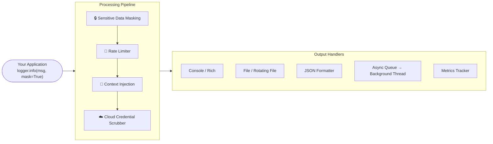

---
hide:
  - navigation
  - toc
---

<div class="hero" markdown>

  
**Secure, Production-Ready Logging for Python**

A logging library designed for data professionals and developers who need reliable, secure logging with minimal setup.

[Get Started](installation.md){ .md-button .md-button--primary }
[View on GitHub](https://github.com/vertex-ai-automations/pylogshield){ .md-button }

</div>

---

<div align="center" markdown>

[](https://pypi.org/project/pylogshield/)
[](https://pypi.org/project/pylogshield/)
[](https://github.com/vertex-ai-automations/pylogshield/blob/main/LICENSE.txt)
[](https://pypi.org/project/pylogshield/)
[](https://github.com/vertex-ai-automations/pylogshield/actions)

</div>

---

## Why PyLogShield?

PyLogShield extends Python's standard `logging` module with production-ready features commonly needed in data engineering and application development—without the complexity.

<div class="feature-grid" markdown>

<div class="feature-item" markdown>

### :material-shield-lock: Sensitive Data Masking

Automatically masks passwords, tokens, API keys, and other sensitive fields. Never accidentally leak credentials in your logs again.

```python
logger.info({"password": "secret"}, mask=True)
# Output: {"password": "***"}
```

</div>

<div class="feature-item" markdown>

### :material-speedometer: Rate Limiting

Prevent log flooding by suppressing duplicate messages within a configurable time window.

```python
logger = get_logger("app", rate_limit_seconds=2.0)
logger.info("Retry")  # Logged
logger.info("Retry")  # Suppressed (within 2s)
```

</div>

<div class="feature-item" markdown>

### :material-code-json: JSON Formatting

Structured JSON output with ISO 8601 timestamps, perfect for log aggregation tools like ELK, Splunk, and CloudWatch.

```python
logger = get_logger("app", enable_json=True)
logger.info("Started")
# {"timestamp": "...", "level": "INFO", ...}
```

</div>

<div class="feature-item" markdown>

### :material-rotate-3d-variant: Log Rotation

Automatically rotate log files based on size with configurable backup counts.

```python
logger = get_logger("app",
    rotate_file=True,
    rotate_max_bytes=5_000_000)
```

</div>

<div class="feature-item" markdown>

### :material-lightning-bolt: Async Logging

Offload logging to a background thread for improved performance in high-throughput applications.

```python
logger = get_logger("app", use_queue=True)
# Non-blocking log writes
```

</div>

<div class="feature-item" markdown>

### :material-console: CLI Log Viewer

View and follow logs from the command line with rich formatting and filtering.

```bash
pylogshield follow -f app.log -l ERROR
```

</div>

<div class="feature-item" markdown>

### :material-arrow-right-circle: Context Propagation

Inject structured fields into every log record within a code block — thread-safe and asyncio-safe via Python's `contextvars`.

```python
with log_context(request_id="abc", user_id=42):
    logger.info("Processing")
# JSON output includes request_id and user_id
```

</div>

<div class="feature-item" markdown>

### :material-web: FastAPI Middleware

Automatically inject `request_id`, HTTP method, path, and client IP into every log during a request.

```python
app.add_middleware(PyLogShieldMiddleware, logger=logger)
# Every log in a request carries request context
```

</div>

</div>

---

## Quick Start

### Installation

```bash
pip install pylogshield
```

### Basic Usage

```python
from pylogshield import get_logger

# Create a logger
logger = get_logger("my_app", log_level="INFO")

# Standard logging
logger.info("Application started")
logger.warning("Low memory")
logger.error("Connection failed")

# Log with sensitive data masking
logger.info({
    "user": "john",
    "api_key": "sk-1234567890"
}, mask=True)
# Output: {"user": "john", "api_key": "***"}
```

### Production Configuration

```python
from pylogshield import get_logger, add_sensitive_fields

# Add custom sensitive fields
add_sensitive_fields(["ssn", "credit_card"])

# Create a production-ready logger
logger = get_logger(
    "production_app",
    log_level="INFO",
    enable_json=True,           # Structured JSON output
    rotate_file=True,           # Auto-rotate logs
    rotate_max_bytes=10_000_000,# 10 MB per file
    rate_limit_seconds=0.5,     # Prevent flooding
    use_queue=True,             # Async logging
    queue_maxsize=50_000,       # Cap queue memory
    enable_metrics=True,        # Track log stats
    enable_context=True,        # Structured context injection
)

logger.info("Production logger ready")
```

---

## Feature Comparison

| Feature | Standard Logging | PyLogShield |
|---------|-----------------|-------------|
| Basic logging | :material-check: | :material-check: |
| Sensitive data masking | :material-close: | :material-check: |
| Rate limiting | :material-close: | :material-check: |
| JSON formatting | Manual setup | :material-check: Built-in |
| Log rotation | Separate handler | :material-check: Integrated |
| Async logging | Manual setup | :material-check: One flag |
| CLI viewer | :material-close: | :material-check: |
| Metrics | :material-close: | :material-check: |
| Context propagation | :material-close: | :material-check: |
| FastAPI middleware | :material-close: | :material-check: |
| Cloud credential scrubbing | :material-close: | :material-check: |

---

## Architecture

PyLogShield wraps every log call in a processing pipeline before handing off to your configured output handlers.



---

## Next Steps

<div class="feature-grid" markdown>

<div class="feature-item" markdown>

### :material-rocket-launch: Getting Started

Learn how to install and configure PyLogShield for your project.

[Installation Guide](installation.md){ .md-button }

</div>

<div class="feature-item" markdown>

### :material-book-open-variant: Usage Guide

Explore all features with detailed examples.

[Basic Usage](usage.md){ .md-button }

</div>

<div class="feature-item" markdown>

### :material-api: API Reference

Complete API documentation with all parameters and options.

[API Reference](references/logger.md){ .md-button }

</div>

</div>

---

## Contributing

All contributions are welcome! If you have a suggestion that would make this better, please fork the repo and create a pull request.

[:fontawesome-brands-github: View on GitHub](https://github.com/vertex-ai-automations/pylogshield){ .md-button }
[:fontawesome-solid-bug: Report an Issue](https://github.com/vertex-ai-automations/pylogshield/issues/new){ .md-button }
