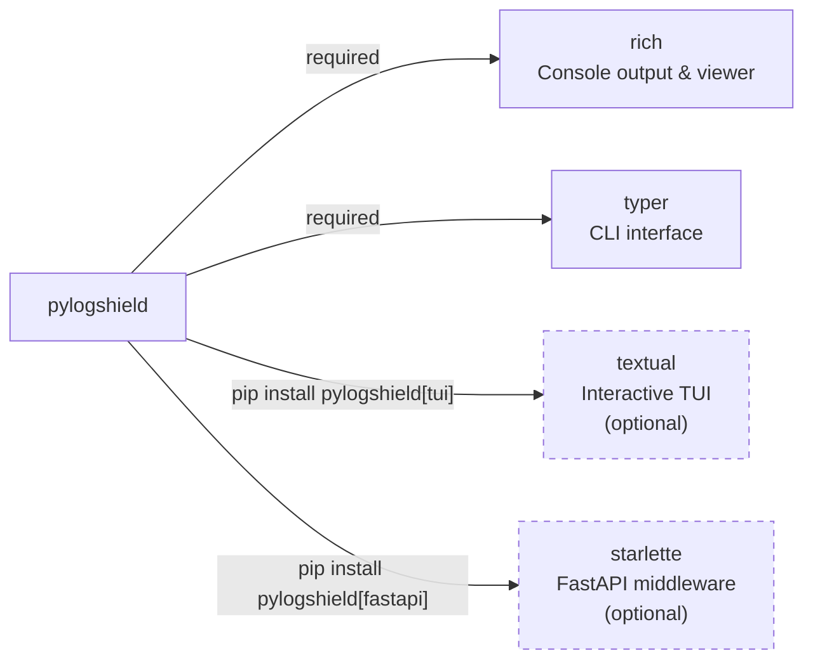

# Installation

## Requirements

- Python 3.8 or higher
- pip (Python package manager)

## Quick Install

=== "pip"

    ```bash
    pip install pylogshield
    ```

=== "pip (with Interactive TUI)"

    ```bash
    # Install with the full-screen interactive TUI log viewer
    pip install "pylogshield[tui]"
    ```

=== "pip (with FastAPI middleware)"

    ```bash
    # Install with FastAPI/Starlette middleware support
    pip install "pylogshield[fastapi]"
    ```

=== "pip (all extras)"

    ```bash
    pip install "pylogshield[tui,fastapi]"
    ```

=== "Poetry"

    ```bash
    poetry add pylogshield
    ```

=== "Pipenv"

    ```bash
    pipenv install pylogshield
    ```

## Dependency Graph



## Upgrade

To upgrade to the latest version:

```bash
pip install --upgrade pylogshield
```

## Verify Installation

```python
import pylogshield
print(pylogshield.__version__)
```

Or from the command line:

```bash
pylogshield --help
```

Expected output:

```
Usage: pylogshield [OPTIONS] COMMAND [ARGS]...

Commands:
  follow  Live-follow a log file (tail -f style)
  levels  List supported log levels
  view    Pretty-print logs from a file
```

## Dependencies

PyLogShield has minimal mandatory dependencies:

| Package | Purpose |
|---------|---------|
| `rich` | Colorized console output and log viewer |
| `typer` | CLI interface |

These are installed automatically when you install PyLogShield.

## Optional Extras

| Extra | Command | Adds |
|-------|---------|------|
| `fastapi` | `pip install "pylogshield[fastapi]"` | `PyLogShieldMiddleware` for FastAPI/Starlette |
| `tui` | `pip install "pylogshield[tui]"` | Full-screen interactive TUI log viewer (`LogViewerApp`) |

## Development Installation

To install for development:

```bash
# Clone the repository
git clone https://github.com/vertex-ai-automations/pylogshield.git
cd pylogshield

# Install in development mode
pip install -e .

# Install test dependencies
pip install -r tests/requirements.txt

# Run tests
pytest tests/ -v
```

## Troubleshooting

### Permission Errors

If you encounter permission errors during installation:

```bash
pip install --user pylogshield
```

### Version Conflicts

If you have version conflicts with dependencies:

```bash
pip install pylogshield --upgrade --force-reinstall
```

### Virtual Environment (Recommended)

We recommend using a virtual environment:

```bash
# Create virtual environment
python -m venv venv

# Activate it
# On Windows:
venv\Scripts\activate
# On macOS/Linux:
source venv/bin/activate

# Install PyLogShield
pip install pylogshield
```

---

## Next Steps

Now that you have PyLogShield installed, learn how to use it:

- [Basic Usage](usage.md) - Learn the fundamentals
- [CLI Usage](cli_usage.md) - Use the command-line viewer
- [API Reference](references/logger.md) - Complete API documentation
