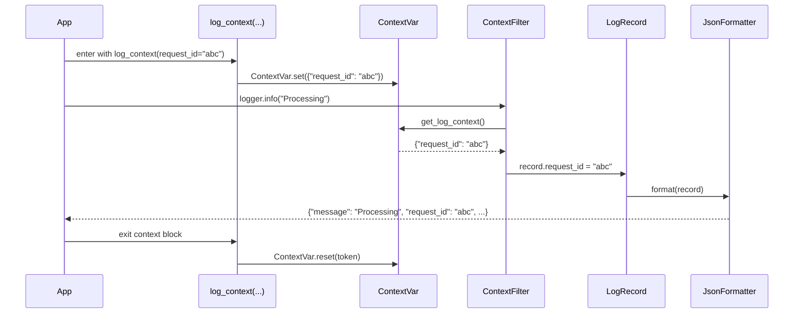

# Context Propagation

PyLogShield supports thread-safe and asyncio-safe structured log context injection via Python's `contextvars` module. Any key/value pairs set inside a `log_context` or `async_log_context` block are automatically attached to every log record emitted by a logger that has `enable_context=True`.

## Quick Reference

```python
from pylogshield import get_logger
from pylogshield.context import log_context, async_log_context

logger = get_logger("app", enable_context=True, enable_json=True)

# Sync context
with log_context(request_id="abc-123", user_id=42):
    logger.info("Processing order")
    # JSON output includes request_id and user_id

# Async context
async with async_log_context(request_id="xyz-999"):
    logger.info("Async handler")
```

## How It Works

When `enable_context=True` is passed to `get_logger()` or `PyLogShield()`, a `ContextFilter` is installed on the logger. The filter reads the current context dict from a `ContextVar` and injects each key directly onto the `LogRecord` before it reaches any formatter or handler.

With `JsonFormatter`, context fields are promoted to the **top level** of the JSON envelope alongside `timestamp`, `level`, and `message`.



## log_context

Sync context manager. Fields are merged on top of any already-active context, so nesting works as expected. The previous context is always restored on exit—even if an exception is raised.

```python
from pylogshield.context import log_context, get_log_context

logger = get_logger("api", enable_context=True, enable_json=True)

with log_context(service="payments"):
    logger.info("Payment service started")
    # → {"service": "payments", "message": "Payment service started", ...}

    with log_context(transaction_id="tx-7", amount=99.99):
        logger.info("Charge applied")
        # → {"service": "payments", "transaction_id": "tx-7", "amount": 99.99, ...}
        print(get_log_context())
        # {'service': 'payments', 'transaction_id': 'tx-7', 'amount': 99.99}

    logger.info("Transaction complete")
    # → {"service": "payments", "message": "Transaction complete", ...}
    # transaction_id is gone; service is restored

logger.info("Done")  # no context fields at all
```

**Behaviour when an exception is raised inside the block:**

```python
with log_context(service="billing"):
    try:
        with log_context(step="charge"):
            raise RuntimeError("card declined")
    except RuntimeError:
        logger.exception("Charge failed")
        # → {"service": "billing", "message": "Charge failed", ...}
        # 'step' is gone even though the inner block raised — the context is
        # always restored by the finally clause inside log_context.
```

## async_log_context

Async context manager. Each asyncio task gets its own copy of the `ContextVar`, so concurrent tasks cannot bleed context into each other.

```python
import asyncio
from pylogshield.context import async_log_context

async def handle_request(request_id: str):
    async with async_log_context(request_id=request_id):
        logger.info("Handling request")  # carries request_id

# Safe with asyncio.gather — no cross-task bleed
await asyncio.gather(
    handle_request("req-1"),
    handle_request("req-2"),
)
```

## ContextFilter

The filter that connects the `ContextVar` to the logging system. Added automatically when `enable_context=True`; can also be added manually:

```python
from pylogshield.context import ContextFilter, log_context
import logging

logger = logging.getLogger("my_app")
logger.addFilter(ContextFilter())

with log_context(env="prod"):
    logger.info("Deployed")  # record.env == "prod"
```

!!! warning "Reserved field names"
    Context keys that conflict with standard `LogRecord` attributes (e.g., `name`, `msg`, `levelname`, `exc_info`, `args`) are silently skipped and a `warnings.warn` is emitted once per conflicting key per `ContextFilter` instance. The warning message suggests a safe rename — for example, using `name` as a context key would warn:

    ```
    pylogshield: context key 'name' conflicts with a standard LogRecord attribute
    and will be ignored. Use a different name (e.g. 'ctx_name') to avoid this conflict.
    ```

    Rename your key (e.g. `service_name`, `logger_name`) to avoid this.

## get_log_context

Returns the current context dict for the active thread or asyncio task. Returns an empty dict when no context block is active.

```python
from pylogshield.context import get_log_context

ctx = get_log_context()
print(ctx)  # {'request_id': 'abc-123', 'user_id': 42}
```

## Production Example (with JSON)

```python
from pylogshield import get_logger
from pylogshield.context import log_context

logger = get_logger("api", enable_context=True, enable_json=True)

def process_payment(user_id: int, amount: float):
    with log_context(user_id=user_id, operation="payment"):
        logger.info("Payment initiated", extra={"amount": amount})
        # ...
        logger.info("Payment complete")
```

JSON output:
```json
{"timestamp": "...", "level": "INFO", "message": "Payment initiated", "user_id": 123, "operation": "payment", "amount": 99.99}
```

---

## API Reference

::: pylogshield.context
    options:
      show_root_heading: true
      show_source: true
      members:
        - log_context
        - async_log_context
        - get_log_context
        - ContextFilter
