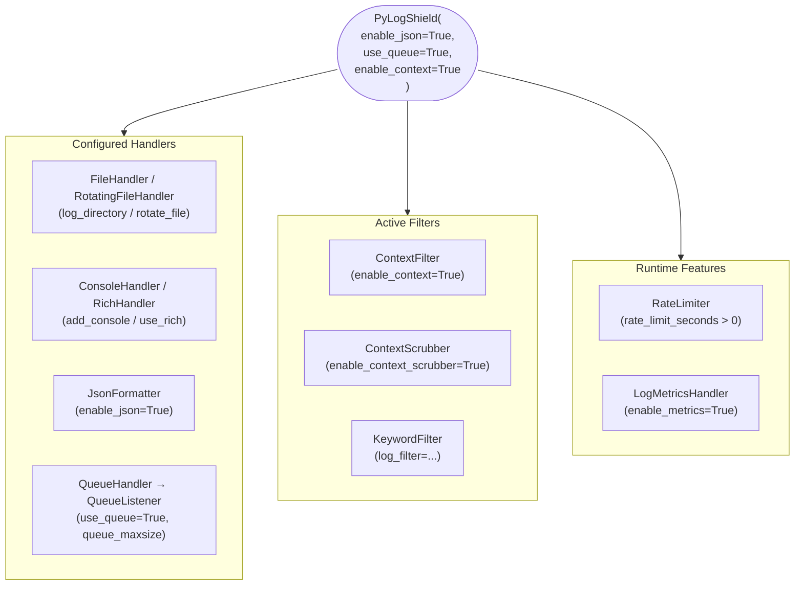

# PyLogShield Logger

The main logger class that extends Python's standard `logging.Logger` with additional features.

## Quick Reference

```python
from pylogshield import get_logger, PyLogShield

# Recommended: Use get_logger for singleton pattern
logger = get_logger("my_app", log_level="INFO", enable_json=True)

# Alternative: Direct instantiation
logger = PyLogShield("my_app", log_level="INFO")
```

## Common Parameters

| Parameter | Type | Default | Description |
|-----------|------|---------|-------------|
| `name` | `str` | Required | Logger name |
| `log_level` | `str \| int` | `INFO` | Logging level |
| `enable_json` | `bool` | `False` | Output JSON format |
| `use_queue` | `bool` | `False` | Async logging |
| `use_rich` | `bool` | `False` | Rich console output |
| `rate_limit_seconds` | `float` | `0.0` | Rate limiting interval |
| `log_directory` | `str \| Path` | `~/.logs` | Log file directory |
| `log_file` | `str` | `{name}.log` | Log file name |
| `rotate_file` | `bool` | `False` | Enable log rotation |
| `rotate_max_bytes` | `int` | `5000000` | Max file size before rotation |
| `rotate_backup_count` | `int` | `5` | Number of backup files |
| `add_console` | `bool` | `True` | Add a console handler on creation |
| `enable_metrics` | `bool` | `False` | Enable metrics tracking |
| `enable_context_scrubber` | `bool` | `True` | Remove cloud credentials |
| `enable_context` | `bool` | `False` | Install `ContextFilter`; pairs with `log_context()`/`async_log_context()` |
| `queue_maxsize` | `int` | `0` | Max async queue size (0 = unbounded); only used when `use_queue=True` |



## Examples

### Basic Logging

```python
from pylogshield import get_logger

logger = get_logger("my_app")

logger.debug("Debug message")
logger.info("Info message")
logger.warning("Warning message")
logger.error("Error message")
logger.critical("Critical message")
```

### Sensitive Data Masking

```python
logger = get_logger("secure_app")

# Enable masking with mask=True
logger.info({"user": "john", "password": "secret"}, mask=True)
# Output: {"user": "john", "password": "***"}
```

### JSON Logging

```python
logger = get_logger("json_app", enable_json=True)

logger.info("User logged in")
# Output: {"timestamp": "2024-01-15T10:30:00+00:00", "level": "INFO", ...}
```

### Log Rotation

```python
logger = get_logger(
    "rotating_app",
    rotate_file=True,
    rotate_max_bytes=10_000_000,  # 10 MB
    rotate_backup_count=5
)
```

### Context Propagation

```python
from pylogshield import get_logger
from pylogshield.context import log_context

logger = get_logger("api", enable_context=True, enable_json=True)

with log_context(request_id="abc-123"):
    logger.info("Processing")
    # JSON output includes request_id field
```

### Exception Logging with Masking

```python
try:
    connect_db(password=secret)
except Exception:
    logger.exception("DB connection failed", mask=True)
    # exception .args are masked; traceback locals are NOT redacted
```

!!! warning
    `mask=True` does not redact traceback frame locals. See [Sensitive Data Masking](../usage.md#sensitive-data-masking) for details.

### Replacing an Existing Logger (`force=True`)

```python
import logging

# Third-party code may already have a standard logger registered
logging.getLogger("shared_service")

# get_logger raises TypeError by default — use force=True to replace it
logger = get_logger("shared_service", force=True, enable_json=True)
```

!!! warning
    `force=True` emits a `UserWarning` before replacing the existing logger.
    Any code that already holds a reference to the old logger will stop
    receiving records once it is replaced.

### Production Setup with Async + Rotation + Context

```python
from pylogshield import get_logger, add_sensitive_fields
from pylogshield.context import log_context

# Register domain-specific sensitive fields once at startup
add_sensitive_fields(["account_number", "sort_code", "national_id"])

logger = get_logger(
    "payments",
    log_level="INFO",
    enable_json=True,           # Structured output for ELK / Datadog
    rotate_file=True,           # Rotate when file hits 50 MB
    rotate_max_bytes=50_000_000,
    rotate_backup_count=10,
    use_queue=True,             # Non-blocking: log calls return immediately
    queue_maxsize=100_000,      # Drop new messages if queue fills (not block)
    rate_limit_seconds=1.0,     # At most 1 identical message per second
    enable_metrics=True,        # Count logs by level
    enable_context=True,        # Allow log_context() injection
)

def process_payment(user_id: int, amount: float, account_number: str) -> None:
    with log_context(user_id=user_id, operation="payment"):
        logger.info(
            {"account_number": account_number, "amount": amount},
            mask=True,          # account_number → "***"
        )
        # ... business logic ...
        logger.info("Payment authorised")

# At application shutdown — flush remaining queued messages
logger.shutdown()
metrics = logger.get_metrics()
print(f"Logged {metrics['count']} records in {metrics['elapsed']:.1f}s")
```

---

## API Reference

::: pylogshield.core.PyLogShield
    options:
      show_root_heading: true
      show_source: true
      members:
        - __init__
        - info
        - debug
        - warning
        - error
        - critical
        - exception
        - set_log_level
        - get_metrics
        - context
        - async_context
        - shutdown
        - from_config
        - add_sensitive_fields

---

## get_logger Function

::: pylogshield.get_logger
    options:
      show_root_heading: true
      show_source: true
