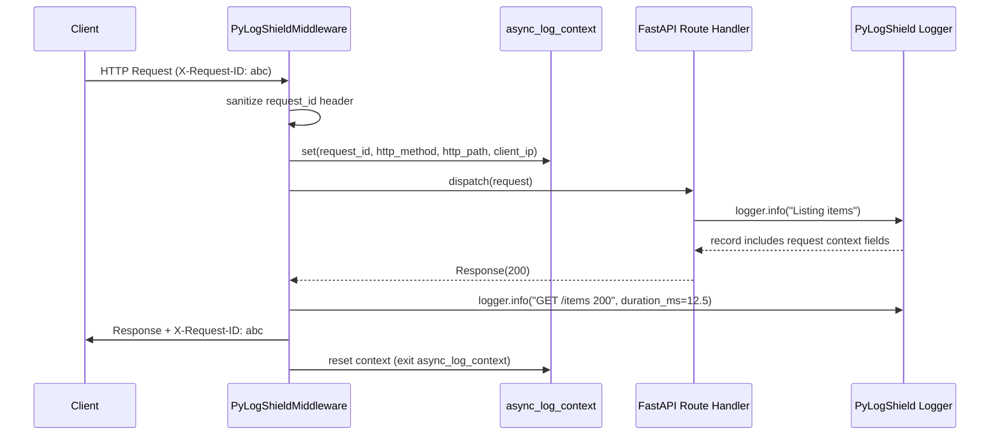

# FastAPI / Starlette Middleware

`PyLogShieldMiddleware` is an ASGI middleware for FastAPI and Starlette that automatically injects structured request context into every log record emitted during a request.

## Installation

The middleware requires the optional `fastapi` extra:

```bash
pip install "pylogshield[fastapi]"
```

## Features

For every incoming request the middleware:

1. Reads (or generates) a `request_id` correlation ID from the `X-Request-ID` header
2. Injects `request_id`, `http_method`, `http_path`, and `client_ip` into every log record via `async_log_context`
3. Logs request completion at INFO level (method, path, status code, duration_ms)
4. Echoes the `request_id` back in the response header

!!! note "Header sanitization"
    The incoming `X-Request-ID` header value is automatically sanitized: truncated to 128 characters and stripped of any characters outside `[A-Za-z0-9\-_]`. If the sanitized value is empty, a fresh UUID4 is generated.



## Basic Setup

```python
from fastapi import FastAPI
from pylogshield import get_logger
from pylogshield.middleware import PyLogShieldMiddleware

app = FastAPI()
logger = get_logger("api", enable_context=True, enable_json=True)
app.add_middleware(PyLogShieldMiddleware, logger=logger)

@app.get("/items")
async def list_items():
    logger.info("Listing items")
    # Every log line automatically includes:
    # request_id, http_method, http_path, client_ip
    return []
```

## Parameters

| Parameter | Type | Default | Description |
|-----------|------|---------|-------------|
| `app` | `ASGIApp` | Required | The ASGI application to wrap |
| `logger` | `PyLogShield` | Required | Logger with `enable_context=True` |
| `request_id_header` | `str` | `"X-Request-ID"` | Header used to read/write the correlation ID |
| `log_requests` | `bool` | `True` | Emit an INFO log on each request completion |

## Custom Correlation Header

```python
app.add_middleware(
    PyLogShieldMiddleware,
    logger=logger,
    request_id_header="X-Correlation-ID",
)
```

## Log Output Example

With `enable_json=True`, every log line during a request includes the injected context:

```json
{"timestamp": "...", "level": "INFO", "message": "Listing items", "request_id": "a1b2c3", "http_method": "GET", "http_path": "/items", "client_ip": "10.0.0.1"}
```

The request completion summary line:
```json
{"timestamp": "...", "level": "INFO", "message": "GET /items 200", "request_id": "a1b2c3", "duration_ms": 12.5, "status_code": 200}
```

## Error Handling

If the request handler raises an unhandled exception, the middleware logs it at ERROR level with `exc_info=True` before re-raising:

```json
{"timestamp": "...", "level": "ERROR", "message": "GET /items failed after 5.2ms", "request_id": "a1b2c3", ...}
```

---

## API Reference

::: pylogshield.middleware.PyLogShieldMiddleware
    options:
      show_root_heading: true
      show_source: true
      members:
        - __init__
        - dispatch
