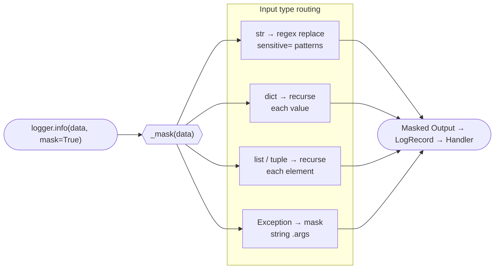
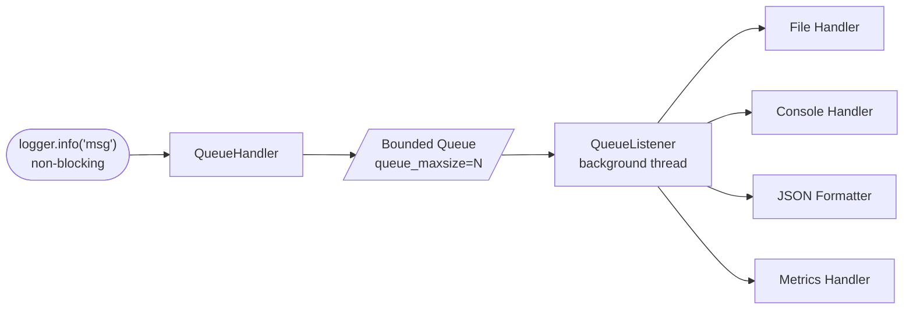

# Basic Usage

PyLogShield extends Python's standard logging with features like sensitive data masking, log rotation, asynchronous logging, rate limiting, and dynamic configuration.

## Getting Started

```python
from pylogshield import get_logger, PyLogShield

# Recommended: Use get_logger for reusable named loggers
logger = get_logger(name="my_app", log_level="DEBUG")

# Alternative: Create directly with PyLogShield
logger = PyLogShield(name="my_app", log_level="DEBUG")

# Standard logging methods
logger.debug("Debug message")
logger.info("Informational message")
logger.warning("Warning message")
logger.error("Error message")
logger.critical("Critical message")
```

See the [PyLogShield API Reference](./references/logger.md) for all available parameters.

---

## Sensitive Data Masking

Automatically mask sensitive fields like passwords, tokens, and API keys.



```python
from pylogshield import get_logger

logger = get_logger("my_app")

# Enable masking with mask=True
logger.info({"user": "john_doe", "password": "secret123"}, mask=True)
# Output: {"user": "john_doe", "password": "***"}

# Works with nested structures
logger.info({
    "user": "john",
    "credentials": {
        "api_key": "abc123",
        "token": "xyz789"
    }
}, mask=True)
# Output: {"user": "john", "credentials": {"api_key": "***", "token": "***"}}

# Also masks in plain text
logger.info("User logged in with password: secret123", mask=True)
# Output: User logged in with password: ***
```

!!! warning "Exception tracebacks"
    `mask=True` masks the exception's `.args` string values. Traceback locals and frame variables are formatted by the log handler and are **not** redacted. Avoid passing sensitive data as local variables in functions that may log exceptions.

### Managing Sensitive Fields

```python
from pylogshield import (
    get_logger,
    add_sensitive_fields,
    remove_sensitive_fields,
    get_sensitive_fields
)

# View current sensitive fields
print(get_sensitive_fields())
# {'password', 'token', 'api_key', 'secret', ...}

# Add custom sensitive fields
add_sensitive_fields(["ssn", "credit_card", "bank_account"])

# Remove fields from sensitive list
remove_sensitive_fields(["auth"])

# Or add via logger instance
logger = get_logger("my_app")
logger.add_sensitive_fields(["custom_secret"])
```

---

## Rate Limiting

Prevent log flooding by suppressing duplicate messages within a time interval.

```python
from pylogshield import get_logger
import time

# Initialize logger with rate limiting (2 seconds between identical messages)
logger = get_logger("my_app", rate_limit_seconds=2.0)

# First call logs immediately
logger.info("Connection attempt")  # Logged

# Same message within 2 seconds is suppressed
logger.info("Connection attempt")  # Suppressed
logger.info("Connection attempt")  # Suppressed

time.sleep(2.1)

# After interval passes, message is logged again
logger.info("Connection attempt")  # Logged
```

### Checking Rate Limiter Statistics

```python
logger = get_logger("my_app", rate_limit_seconds=1.0)

# After some logging...
if logger.limiter:
    print(f"Suppressed messages: {logger.limiter.suppressed_count}")
    print(f"Tracked messages: {logger.limiter.tracked_messages}")
```

---

## Log Filtering

Filter logs by keywords to include or exclude specific messages.

```python
from pylogshield import get_logger, KeywordFilter

# Include only logs containing specific keywords
logger = get_logger("my_app", log_filter=["error", "critical", "failed"])

logger.info("Application started")      # Not logged (no matching keyword)
logger.info("Connection failed")        # Logged (contains "failed")
logger.error("An error occurred!")      # Logged (contains "error")

# Or create a filter manually for more control
exclude_filter = KeywordFilter(
    keywords=["debug", "trace"],
    include=False,  # Exclude mode
    case_insensitive=True
)
```

---

## Custom Log Levels

Register custom log levels like SECURITY, AUDIT, or TRACE at runtime.

```python
from pylogshield import get_logger, add_log_level, PyLogShield

# Register a custom SECURITY level (between WARNING and ERROR)
add_log_level("SECURITY", 35, logger_cls=PyLogShield)

# Now use it
logger = get_logger("secure_app")
logger.security("Unauthorized access attempt blocked", mask=True)
```

---

## Dynamic Log Level Adjustment

Change log levels at runtime without restarting the application.

```python
from pylogshield import get_logger

logger = get_logger("my_app", log_level="INFO")

logger.debug("This won't be logged")  # Below INFO level
logger.info("This will be logged")

# Change level at runtime
logger.set_log_level("DEBUG")

logger.debug("Now this will be logged")  # DEBUG is now enabled
```

---

## Performance Metrics

Track logging activity with built-in metrics.

```python
from pylogshield import get_logger

logger = get_logger("my_app", enable_metrics=True)

# Log some messages
logger.info("Processing started")
logger.info("Processing item 1")
logger.error("Item 2 failed")
logger.info("Processing complete")

# Get metrics
metrics = logger.get_metrics()
print(metrics)
# {
#     'INFO': 1.5,      # logs per second
#     'ERROR': 0.5,
#     'count': 4,       # total count
#     'elapsed': 2.0    # seconds since start
# }

# Get counts only
if logger.metrics_handler:
    print(logger.metrics_handler.counts())
    # {'INFO': 3, 'ERROR': 1}  ← plain dict, not Counter
```

---

## JSON Log Formatting

Output structured JSON logs for integration with log aggregation tools (ELK, Splunk, etc.).

```python
from pylogshield import get_logger

logger = get_logger("my_app", enable_json=True)

logger.info("User logged in")
```

Output:
```json
{
    "timestamp": "2024-01-15T10:30:00.123+00:00",
    "host": "server-01",
    "logger": "my_app",
    "level": "INFO",
    "message": "User logged in"
}
```

---

## Log Rotation

Automatically rotate log files when they reach a certain size.

```python
from pylogshield import get_logger

logger = get_logger(
    "my_app",
    rotate_file=True,
    rotate_max_bytes=5_000_000,  # 5 MB
    rotate_backup_count=3        # Keep 3 backup files
)

logger.info("This log will rotate when the file exceeds 5 MB")
```

This creates files like:
- `my_app.log` (current)
- `my_app.log.1` (previous)
- `my_app.log.2`
- `my_app.log.3`

---

## Asynchronous Logging

Offload logging to a background thread for improved performance in high-throughput applications.



```python
from pylogshield import get_logger

logger = get_logger("my_app", use_queue=True)

# Logs are queued and written in background
for i in range(10000):
    logger.info(f"Processing item {i}")

# Important: Shutdown cleanly to flush remaining logs
logger.shutdown()
```

### Bounded Queue

By default the async queue is unbounded. In high-throughput scenarios you can cap it to avoid unbounded memory growth:

```python
logger = get_logger("app", use_queue=True, queue_maxsize=10_000)
# Messages are dropped (not blocked) when the queue is full
logger.shutdown()  # Always flush on exit
```

---

## Context Scrubbing

Automatically remove cloud provider credentials from log records.

```python
from pylogshield import get_logger, ContextScrubber

# Enabled by default - removes AWS_, AZURE_, GCP_, GOOGLE_, TOKEN prefixed attributes
logger = get_logger("my_app", enable_context_scrubber=True)

# Or disable it
logger = get_logger("my_app", enable_context_scrubber=False)

# Custom prefixes
from pylogshield import ContextScrubber
scrubber = ContextScrubber(forbidden_prefixes=("SECRET_", "PRIVATE_", "INTERNAL_"))
```

---

## Context Propagation

Inject structured fields into every log record within a block using `log_context` (sync) or `async_log_context` (async). Requires `enable_context=True` on the logger.

```python
from pylogshield import get_logger
from pylogshield.context import log_context, async_log_context

logger = get_logger("app", enable_context=True, enable_json=True)

# Sync context
with log_context(request_id="abc-123", user_id=42):
    logger.info("Processing order")
    # JSON includes request_id and user_id automatically

# Nested contexts — inner fields merge on top of outer
with log_context(service="payments"):
    with log_context(transaction_id="tx-7"):
        logger.info("Charge")  # has both service and transaction_id

# Async context (asyncio-safe, no cross-task bleed)
async def handle(req_id: str):
    async with async_log_context(request_id=req_id):
        logger.info("Handling request")
```

See the [Context Propagation reference](./references/context.md) for full details.

---

## FastAPI / Starlette Middleware

Automatically inject request context into all logs for a FastAPI app. Requires `pip install "pylogshield[fastapi]"`.

```python
from fastapi import FastAPI
from pylogshield import get_logger
from pylogshield.middleware import PyLogShieldMiddleware

app = FastAPI()
logger = get_logger("api", enable_context=True, enable_json=True)
app.add_middleware(PyLogShieldMiddleware, logger=logger)

@app.get("/items")
async def list_items():
    logger.info("Listing items")
    # Logs automatically include request_id, http_method, http_path, client_ip
    return []
```

See the [Middleware reference](./references/middleware.md) for full details.

---

## Rich Console Output

Enable colorized terminal output for better readability during development.

```python
from pylogshield import get_logger

logger = get_logger("my_app", use_rich=True)

logger.debug("Debug message")     # Dim
logger.info("Info message")       # Normal
logger.warning("Warning message") # Yellow
logger.error("Error message")     # Red
logger.critical("Critical!")      # Bold Red
```

---

## Interactive Log Viewer

View logs in a formatted table.

```python
from pylogshield import LogViewer
from pathlib import Path

viewer = LogViewer(Path("~/.logs/my_app.log").expanduser())

# Display last 100 logs
viewer.display_logs(limit=100)

# Filter by level
viewer.display_logs(limit=50, level="ERROR")

# Filter by keyword
viewer.display_logs(limit=50, keyword="database")

# Live follow (like tail -f)
viewer.follow_logs(level="INFO", interval=0.5)
```

---

## Configuration from Dictionary

Create loggers from configuration dictionaries (useful for loading from YAML/JSON files).

```python
from pylogshield import PyLogShield

config = {
    "level": "DEBUG",
    "enable_json": True,
    "rotate_file": True,
    "rotate_max_bytes": 10_000_000,
    "rate_limit_seconds": 1.0,
    "log_filter": ["error", "warning"],
    "enable_metrics": True
}

logger = PyLogShield.from_config("my_app", config)
```

---

## Complete Example

```python
from pylogshield import get_logger, add_sensitive_fields
from pylogshield.context import log_context

# Configure sensitive fields
add_sensitive_fields(["ssn", "credit_card"])

# Create a production-ready logger
logger = get_logger(
    "production_app",
    log_level="INFO",
    enable_json=True,
    rotate_file=True,
    rotate_max_bytes=10_000_000,
    rotate_backup_count=5,
    rate_limit_seconds=0.5,
    use_queue=True,
    queue_maxsize=50_000,
    enable_metrics=True,
    enable_context_scrubber=True,
    enable_context=True,
)

logger.info("Application starting")

with log_context(session_id="s-abc123"):
    logger.info({"action": "login", "user": "john", "token": "abc123"}, mask=True)

try:
    pass
except Exception as e:
    # Note: mask=True masks exception .args, but traceback locals are not masked
    logger.exception("Unexpected error occurred")

metrics = logger.get_metrics()
logger.info(f"Session stats: {metrics['count']} logs in {metrics['elapsed']:.1f}s")

logger.shutdown()
```
